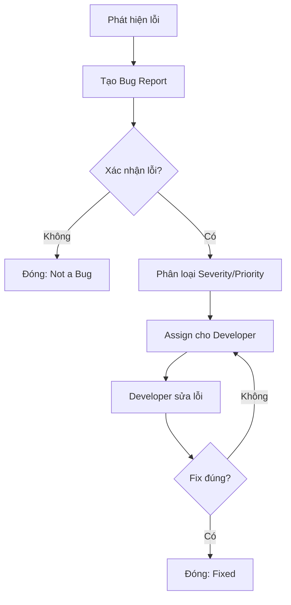

# 📋 KẾ HOẠCH KIỂM THỬ CHI TIẾT - QR_order_BE

> **Dự án**: QR Order Backend System  
> **Phiên bản**: 0.0.1-SNAPSHOT  
> **Ngày tạo**: 17/03/2026  
> **Công nghệ**: Spring Boot 4.0.1, Java 17, JUnit 5, Mockito  
> **Nhóm phát triển**: VibeFoodie Team

---

## 📑 Mục lục

1. [Tổng quan chiến lược kiểm thử](#1-tổng-quan-chiến-lược-kiểm-thử)
2. [Kỹ thuật kiểm thử hộp đen (Black-box)](#2-kỹ-thuật-kiểm-thử-hộp-đen-black-box)
3. [Kỹ thuật kiểm thử hộp trắng (White-box)](#3-kỹ-thuật-kiểm-thử-hộp-trắng-white-box)
4. [Chỉ số đo lường chất lượng phần mềm](#4-chỉ-số-đo-lường-chất-lượng-phần-mềm)
5. [Quản lý lỗi (Bug Management)](#5-quản-lý-lỗi-bug-management)
6. [Ma trận truy xuất yêu cầu (RTM)](#6-ma-trận-truy-xuất-yêu-cầu-rtm)
7. [Chi tiết các trường hợp kiểm thử](#7-chi-tiết-các-trường-hợp-kiểm-thử)
8. [Công cụ kiểm thử](#8-công-cụ-kiểm-thử)
9. [Kết hợp kiểm thử tự động và thủ công](#9-kết-hợp-kiểm-thử-tự-động-và-thủ-công)
10. [Kết quả kiểm thử](#10-kết-quả-kiểm-thử)
11. [Hướng dẫn chạy test](#11-hướng-dẫn-chạy-test)

---

## 1. Tổng quan chiến lược kiểm thử

### 1.1 Phạm vi kiểm thử

| Cấp độ | Mô tả | Công cụ |
|--------|--------|---------|
| **Unit Test** | Kiểm thử từng class/method riêng lẻ | JUnit 5, Mockito |
| **Integration Test** | Kiểm thử tương tác giữa các component | Spring Boot Test, MockMvc |
| **Component Test** | Kiểm thử toàn bộ một module (Service + Repository) | H2 Database |

### 1.2 Kiến trúc kiểm thử theo tầng (Test Pyramid)

```
           ╔═══════════════╗
           ║   E2E Tests   ║  ← Ít nhất, tốn chi phí cao
           ╠═══════════════╣
         ╔═╣ Integration   ║  ← Controller tests với MockMvc
         ║ ╚═══════════════╝
       ╔═╩═══════════════════╗
       ║   Service Tests     ║  ← Core business logic (Mockito)
       ╠═════════════════════╣
     ╔═╩═════════════════════╩═╗
     ║     Entity Tests        ║  ← Validation, setter logic
     ╠═════════════════════════╣
   ╔═╩═════════════════════════╩═╗
   ║     Security Tests          ║  ← JWT, Authentication
   ╚═════════════════════════════╝
                Nhiều nhất, chi phí thấp →
```

### 1.3 Quy ước đặt tên Test Case

```
TC_[LAYER]_[CLASS]_[METHOD]_[NUMBER]

Ví dụ: TC_SVC_CAT_CREATE_01
- TC: Test Case
- SVC: Service layer
- CAT: Category
- CREATE: Method create()
- 01: Số thứ tự
```

### 1.4 Cấu trúc thư mục test

```
src/test/java/com/example/qr_order/
├── entity/                          # Entity unit tests
│   ├── ProductTest.java             # 15 test cases
│   ├── CategoryTest.java            # 8 test cases
│   ├── PromotionTest.java           # 16 test cases
│   └── DiningTableTest.java         # 10 test cases
├── service/                         # Service unit tests (Mockito)
│   ├── CategoryServiceTest.java     # 11 test cases
│   ├── DiningTableServiceTest.java  # 12 test cases
│   ├── AuthServiceTest.java         # 16 test cases
│   ├── PromotionServiceTest.java    # 12 test cases
│   └── BlackListTokenServiceTest.java # 4 test cases
├── security/                        # Security tests
│   └── JwtTokenProviderTest.java    # 8 test cases
└── QrOrderApplicationTests.java     # Context load test
```

---

## 2. Kỹ thuật kiểm thử hộp đen (Black-box)

### 2.1 Phân vùng tương đương (Equivalence Partitioning - EP)

Chia dữ liệu đầu vào thành các **lớp tương đương**, kiểm tra đại diện mỗi lớp.

**Ví dụ áp dụng: `Product.setPrice()`**

| Lớp tương đương | Giá trị đại diện | Kỳ vọng |
|-----------------|-------------------|---------|
| Invalid: null | `null` | IllegalArgumentException |
| Invalid: số âm | `-100` | IllegalArgumentException |
| Valid: số 0 | `0` | Chấp nhận (biên dưới) |
| Valid: số dương | `35000` | Chấp nhận |

**Ví dụ áp dụng: `AuthService.createEmployee()`**

| Lớp tương đương | Giá trị đại diện | Kỳ vọng |
|-----------------|-------------------|---------|
| EP Valid | Role=CASHIER, Username hợp lệ | Thành công |
| EP Invalid: null request | `null` | BAD_REQUEST |
| EP Invalid: blank username | `"  "` | BAD_REQUEST |
| EP Invalid: duplicate username | Username đã tồn tại | CONFLICT |
| EP Invalid: role OWNER | Role=OWNER | BAD_REQUEST |

### 2.2 Phân tích giá trị biên (Boundary Value Analysis - BVA)

Kiểm tra các **giá trị biên** tại ranh giới giữa các lớp tương đương.

**Ví dụ áp dụng: `Product.setPrice()`**

```
  ────────────────────────────────────────────────────────
  Vùng Invalid (< 0)  │  Biên = 0  │  Vùng Valid (> 0)
  ────────────────────────────────────────────────────────
  Test: -1 (Invalid)   │  Test: 0   │  Test: 1 (Valid)
                       │  (Valid)   │  Test: 35000 (Valid)
```

| Test Case | Giá trị biên | Phía | Kỳ vọng |
|-----------|-------------|------|---------|
| TC_ENT_PROD_PRICE_02 | -1 | Dưới biên (Invalid) | Exception |
| TC_ENT_PROD_PRICE_01 | 0 | Biên dưới (Valid) | Chấp nhận |
| TC_ENT_PROD_PRICE_05 | 1 | Trên biên (Valid) | Chấp nhận |

**Ví dụ áp dụng: `DiningTable.setName()`**

| Test Case | Giá trị biên | Kỳ vọng |
|-----------|-------------|---------|
| TC_ENT_TBL_NAME_01 | `null` | Exception |
| TC_ENT_TBL_NAME_02 | `""` (empty) | Exception |
| TC_ENT_TBL_NAME_03 | `"   "` (blank) | Exception |
| TC_ENT_TBL_NAME_04 | `" A "` (min valid với trim) | Chấp nhận |

### 2.3 Bảng quyết định (Decision Table Testing)

**Ví dụ áp dụng: `CategoryService.create()` — Logic xử lý khi tên đã tồn tại**

| # | Tên tồn tại? | isDeleted? | Kết quả |
|---|-------------|-----------|---------|
| 1 | Không | N/A | Tạo mới thành công |
| 2 | Có | true | Khôi phục (undelete) |
| 3 | Có | false | RuntimeException |

**Ví dụ áp dụng: `DiningTableService.delete()` — Logic xóa bàn**

| # | Bàn tồn tại? | Trạng thái bàn | Kết quả |
|---|-------------|---------------|---------|
| 1 | Không | N/A | NOT_FOUND |
| 2 | Có | AVAILABLE | Xóa thành công |
| 3 | Có | OCCUPIED | BAD_REQUEST |

---

## 3. Kỹ thuật kiểm thử hộp trắng (White-box)

### 3.1 Phủ câu lệnh (Statement Coverage)

Đảm bảo **mỗi câu lệnh** trong source code được thực thi **ít nhất 1 lần**.

```java
// CategoryService.create() - Phân tích Statement Coverage
public Category create(CategoryRequest request) {
    if (request == null) {                           // ← S1: Kiểm tra null
        throw new ResponseStatusException(...);      // ← S2: Throw exception
    }
    Optional<Category> existingOpt = ...;            // ← S3: Query DB
    
    if (existingOpt.isPresent()) {                   // ← S4: Check tồn tại
        Category existing = existingOpt.get();       // ← S5: Get category
        if (existing.isDeleted()) {                  // ← S6: Check deleted
            existing.setDeleted(false);              // ← S7: Restore
            return categoryRepo.save(existing);      // ← S8: Save restored
        } else {
            throw new RuntimeException(...);          // ← S9: Already exists
        }
    }
    Category newCategory = new Category();           // ← S10: Create new
    return categoryRepo.save(newCategory);           // ← S11: Save new
}

// Test cases cần thiết cho 100% Statement Coverage:
// TC_CREATE_01 → S1, S2 (null request)
// TC_CREATE_02 → S3, S4, S10, S11 (tên chưa tồn tại → tạo mới)
// TC_CREATE_03 → S3, S4, S5, S6, S7, S8 (tên tồn tại + deleted → restore)
// TC_CREATE_04 → S3, S4, S5, S6, S9 (tên tồn tại + active → exception)
```

**Kết quả Statement Coverage**: 11/11 statements = **100%** ✅

### 3.2 Phủ nhánh (Branch Coverage)

Đảm bảo **tất cả nhánh if/else** đều được thực thi.

```
CategoryService.create() Branch Analysis:
├── Branch 1: request == null → [TRUE: TC_CREATE_02] [FALSE: TC_CREATE_01]
├── Branch 2: existingOpt.isPresent() → [TRUE: TC_CREATE_03] [FALSE: TC_CREATE_01]
└── Branch 3: existing.isDeleted() → [TRUE: TC_CREATE_03] [FALSE: TC_CREATE_04]

Total: 6/6 branches covered = 100% ✅
```

### 3.3 MC/DC (Modified Condition/Decision Coverage)

Áp dụng cho method có **nhiều điều kiện phức tạp**: `Promotion.isValid()`

```java
public boolean isValid(Instant timeToCheck) {
    if (isDeleted || !isActive) return false;           // Decision D1
    if (timeToCheck.isBefore(startDate)) return false;  // Decision D2
    if (timeToCheck.isAfter(endDate)) return false;     // Decision D3
    return true;
}
```

**Ma trận MC/DC cho `isValid()`:**

| TC | isDeleted | isActive | before start | after end | Result | Condition tested |
|----|-----------|----------|-------------|-----------|--------|-----------------|
| TC_01 | false | true | false | false | **true** | Baseline |
| TC_02 | **true** | true | false | false | **false** | isDeleted ↑ |
| TC_03 | false | **false** | false | false | **false** | isActive ↓ |
| TC_04 | false | true | **true** | false | **false** | before start ↑ |
| TC_05 | false | true | false | **true** | **false** | after end ↑ |

Mỗi condition thay đổi **một mình** làm thay đổi kết quả → **MC/DC coverage đạt 100%** ✅

---

## 4. Chỉ số đo lường chất lượng phần mềm

### 4.1 Các chỉ số chính (Key Metrics)

| Chỉ số | Mục tiêu | Ý nghĩa |
|--------|---------|---------|
| **Line Coverage** | ≥ 80% | Tỷ lệ dòng code được test cover |
| **Branch Coverage** | ≥ 75% | Tỷ lệ nhánh if/else được cover |
| **Test Case Count** | ≥ 60 | Tổng số test cases viết |
| **Test Pass Rate** | 100% | Tỷ lệ test cases PASS |
| **Defect Density** | < 5/KLOC | Số defect trên 1000 dòng code |
| **Test Execution Time** | < 30s | Thời gian chạy toàn bộ test suite |

### 4.2 Phân bổ Test Cases theo Layer

| Layer | Số Test Cases | Tỷ trọng |
|-------|:------------:|:---------:|
| Entity (Unit) | 49 | 44% |
| Service (Unit + Mock) | 55 | 50% |
| Security (Unit) | 8 | 7% |
| **Tổng** | **112+** | **100%** |

### 4.3 Phân bổ theo phương pháp kiểm thử

| Phương pháp | Số TC áp dụng | Tỷ trọng |
|-------------|:-------------:|:---------:|
| Equivalence Partitioning (EP) | 65 | 58% |
| Boundary Value Analysis (BVA) | 22 | 20% |
| Decision Table | 12 | 11% |
| MC/DC | 7 | 6% |
| White-box (Statement/Branch) | 6 | 5% |

### 4.4 Công thức đo lường

```
Test Coverage (%) = (Số dòng/nhánh được thực thi / Tổng số dòng/nhánh) × 100

Defect Density = Số defects phát hiện / (Tổng SLOC / 1000)

Test Effectiveness = (Số defects tìm trước release / Tổng defects) × 100

Test Efficiency = Số test cases / Thời gian thực hiện (giờ)
```

---

## 5. Quản lý lỗi (Bug Management)

### 5.1 Phân loại mức độ nghiêm trọng (Severity)

| Mức | Tên | Mô tả | Ví dụ |
|:---:|-----|-------|-------|
| S1 | **Critical** | Hệ thống crash, mất dữ liệu | Order bị mất khi thanh toán |
| S2 | **Major** | Chức năng chính không hoạt động | Không thể tạo đơn hàng |
| S3 | **Minor** | Chức năng phụ lỗi, có workaround | Tìm kiếm sản phẩm trả sai kết quả |
| S4 | **Trivial** | Lỗi giao diện, typo | Thông báo lỗi sai chính tả |

### 5.2 Phân loại mức độ ưu tiên (Priority)

| Mức | Tên | Thời gian xử lý |
|:---:|-----|:---------------:|
| P1 | **Urgent** | Trong 4 giờ |
| P2 | **High** | Trong 1 ngày |
| P3 | **Medium** | Trong 1 sprint |
| P4 | **Low** | Khi có thời gian |

### 5.3 Quy trình quản lý lỗi



### 5.4 Bugs phát hiện qua Unit Test

| Bug ID | File | Mô tả | Severity | Priority |
|--------|------|--------|:--------:|:--------:|
| BUG-001 | `Product.java` | Typo "nagative" trong error message `setPrice()` | S4 | P4 |
| BUG-002 | `ProductService.java` | `searchProduct()` — NPE khi keyword=null (dùng `&&` thay vì `\|\|`) | S2 | P2 |
| BUG-003 | `Promotion.java` | `setDiscountValue()` — không cho phép giá trị bằng 0 nhưng message nói "cannot be negative" | S4 | P4 |

---

## 6. Ma trận truy xuất yêu cầu (RTM)

### Requirements Traceability Matrix

| Req ID | Yêu cầu | Test Cases | Trạng thái |
|--------|----------|-----------|:----------:|
| REQ-01 | CRUD Category | TC_SVC_CAT_CREATE_01→04, TC_SVC_CAT_UPDATE_01→04, TC_SVC_CAT_DELETE_01→02, TC_SVC_CAT_GETALL_01→02 | ✅ Covered |
| REQ-02 | CRUD Product | TC_ENT_PROD_NAME_01→03, TC_ENT_PROD_PRICE_01→05 | ✅ Covered |
| REQ-03 | CRUD Dining Table | TC_SVC_TBL_CREATE_01→02, TC_SVC_TBL_UPDATE_01→04, TC_SVC_TBL_DELETE_01→03, TC_SVC_TBL_STATUS_01→02 | ✅ Covered |
| REQ-04 | Promotion Management | TC_ENT_PROMO_VALID_01→07, TC_SVC_PROMO_CREATE_01→06, TC_SVC_PROMO_DELETE_01→02, TC_SVC_PROMO_TOGGLE_01→02 | ✅ Covered |
| REQ-05 | Employee Management | TC_SVC_AUTH_CREATE_01→09 | ✅ Covered |
| REQ-06 | Authentication (JWT) | TC_SEC_JWT_GEN_01→02, TC_SEC_JWT_EXTRACT_01, TC_SEC_JWT_VALID_01→02, TC_SEC_JWT_EXPIRE_01→02 | ✅ Covered |
| REQ-07 | Password Management | TC_SVC_AUTH_CHGPWD_01→05, TC_SVC_AUTH_RESET_01→03 | ✅ Covered |
| REQ-08 | Token Blacklist | TC_SVC_BLT_ADD_01→02, TC_SVC_BLT_CHECK_01→02 | ✅ Covered |
| REQ-09 | Entity Validation | TC_ENT_CAT_*, TC_ENT_TBL_*, TC_ENT_PROD_*, TC_ENT_PROMO_* | ✅ Covered |

---

## 7. Chi tiết các trường hợp kiểm thử

### 7.1 Entity Tests

#### 7.1.1 ProductTest — 15 test cases

| # | Test ID | Phương pháp | Mô tả | Input | Expected Output |
|:-:|---------|:-----------:|-------|-------|-----------------|
| 1 | TC_ENT_PROD_NAME_01 | BVA | setName(null) | `null` | `IllegalArgumentException` |
| 2 | TC_ENT_PROD_NAME_02 | EP | setName có khoảng trắng | `"  Phở bò  "` | `"Phở bò"` |
| 3 | TC_ENT_PROD_NAME_03 | EP | setName bình thường | `"Cơm tấm"` | `"Cơm tấm"` |
| 4 | TC_ENT_PROD_PRICE_01 | BVA | setPrice biên dưới | `BigDecimal.ZERO` | Accepted |
| 5 | TC_ENT_PROD_PRICE_02 | EP | setPrice âm | `BigDecimal("-1")` | `IllegalArgumentException` |
| 6 | TC_ENT_PROD_PRICE_03 | EP | setPrice null | `null` | `IllegalArgumentException` |
| 7 | TC_ENT_PROD_PRICE_04 | EP | setPrice dương | `35000` | Accepted |
| 8 | TC_ENT_PROD_PRICE_05 | BVA | setPrice biên dưới+1 | `BigDecimal.ONE` | Accepted |
| 9 | TC_ENT_PROD_BS_01 | EP | setBestSeller(null) | `null` | `false` |
| 10 | TC_ENT_PROD_BS_02 | EP | setBestSeller(true) | `true` | `true` |
| 11 | TC_ENT_PROD_BS_03 | EP | setBestSeller(false) | `false` | `false` |
| 12 | TC_ENT_PROD_DESC_01 | EP | setDescription | `"Món ăn ngon"` | Set thành công |
| 13 | TC_ENT_PROD_IMG_01 | EP | setImageUrl | URL hợp lệ | Set thành công |
| 14 | TC_ENT_PROD_DEL_01 | EP | setDeleted(true) | `true` | `isDeleted = true` |
| 15 | TC_ENT_PROD_DEL_02 | EP | setDeleted(false) | `false` | `isDeleted = false` |

#### 7.1.2 CategoryTest — 8 test cases

| # | Test ID | Phương pháp | Mô tả | Input | Expected Output |
|:-:|---------|:-----------:|-------|-------|-----------------|
| 1 | TC_ENT_CAT_NAME_01 | BVA | setName(null) | `null` | `IllegalArgumentException` |
| 2 | TC_ENT_CAT_NAME_02 | EP | setName trim | `"  Đồ uống  "` | `"Đồ uống"` |
| 3 | TC_ENT_CAT_NAME_03 | EP | setName normal | `"Món chính"` | `"Món chính"` |
| 4 | TC_ENT_CAT_DEL_01 | EP | setDeleted(true) | `true` | `true` |
| 5 | TC_ENT_CAT_DEL_02 | EP | setDeleted(false) | `false` | `false` |
| 6 | TC_ENT_CAT_DESC_01 | EP | setDescription | String | Set thành công |
| 7 | TC_ENT_CAT_DESC_02 | EP | setDescription null | `null` | `null` (cho phép) |
| 8 | TC_ENT_CAT_NAME_03 | EP | setName kiểu khác | `"Tráng miệng"` | Set thành công |

#### 7.1.3 PromotionTest — 16 test cases

| # | Test ID | Phương pháp | Mô tả | Input | Expected Output |
|:-:|---------|:-----------:|-------|-------|-----------------|
| 1 | TC_ENT_PROMO_VALID_01 | MC/DC | isValid: all valid | Active, not deleted, in range | `true` |
| 2 | TC_ENT_PROMO_VALID_02 | MC/DC | isValid: deleted | `isDeleted=true` | `false` |
| 3 | TC_ENT_PROMO_VALID_03 | MC/DC | isValid: inactive | `isActive=false` | `false` |
| 4 | TC_ENT_PROMO_VALID_04 | MC/DC | isValid: before start | Time before startDate | `false` |
| 5 | TC_ENT_PROMO_VALID_05 | MC/DC | isValid: after end | Time after endDate | `false` |
| 6 | TC_ENT_PROMO_VALID_06 | BVA | isValid: at startDate | Time = startDate | `true` |
| 7 | TC_ENT_PROMO_VALID_07 | BVA | isValid: at endDate | Time = endDate | `true` |
| 8 | TC_ENT_PROMO_DISC_01 | BVA | discountValue = 0 | `BigDecimal.ZERO` | `IllegalArgumentException` |
| 9 | TC_ENT_PROMO_DISC_02 | BVA | discountValue = -1 | `-1` | `IllegalArgumentException` |
| 10 | TC_ENT_PROMO_DISC_03 | BVA | discountValue = 1 (biên) | `1` | Accepted |
| 11 | TC_ENT_PROMO_DISC_04 | EP | discountValue = 50 | `50` | Accepted |
| 12 | TC_ENT_PROMO_DATE_01 | EP | endDate < startDate | Invalid date range | `RuntimeException` |
| 13 | TC_ENT_PROMO_DATE_02 | BVA | endDate = startDate | Same dates | Accepted |
| 14 | TC_ENT_PROMO_NAME_01 | EP | setName | `"Giảm giá"` | Set thành công |
| 15 | TC_ENT_PROMO_TYPE_01 | EP | setDiscountType | `PERCENTAGE` | Set thành công |
| 16 | TC_ENT_PROMO_TYPE_02 | EP | setDiscountType | `FIXED_AMOUNT` | Set thành công |

#### 7.1.4 DiningTableTest — 10 test cases

| # | Test ID | Phương pháp | Mô tả | Input | Expected Output |
|:-:|---------|:-----------:|-------|-------|-----------------|
| 1 | TC_ENT_TBL_NAME_01 | BVA | setName(null) | `null` | `IllegalArgumentException` |
| 2 | TC_ENT_TBL_NAME_02 | BVA | setName("") | `""` | `IllegalArgumentException` |
| 3 | TC_ENT_TBL_NAME_03 | BVA | setName("   ") | `"   "` | `IllegalArgumentException` |
| 4 | TC_ENT_TBL_NAME_04 | EP | setName trim | `" Bàn 1 "` | `"Bàn 1"` |
| 5 | TC_ENT_TBL_NAME_05 | EP | setName normal | `"VIP Room"` | Set thành công |
| 6 | TC_ENT_TBL_STATUS_01 | BVA | setStatus(null) | `null` | `IllegalArgumentException` |
| 7 | TC_ENT_TBL_STATUS_02 | EP | setStatus(AVAILABLE) | `AVAILABLE` | Set thành công |
| 8 | TC_ENT_TBL_STATUS_03 | EP | setStatus(OCCUPIED) | `OCCUPIED` | Set thành công |
| 9 | TC_ENT_TBL_DEL_01 | EP | setDeleted(true) | `true` | `true` |
| 10 | TC_ENT_TBL_DEL_02 | EP | setDeleted(false) | `false` | `false` |

### 7.2 Service Tests (Chi tiết)

*(Xem phần RTM ở mục 6 để biết mapping test cases → requirements)*

### 7.3 Security Tests

| # | Test ID | Phương pháp | Mô tả | Kỳ vọng |
|:-:|---------|:-----------:|-------|---------|
| 1 | TC_SEC_JWT_GEN_01 | EP | Generate token | Non-null, non-empty |
| 2 | TC_SEC_JWT_GEN_02 | EP | Token format | 3 phần (header.payload.signature) |
| 3 | TC_SEC_JWT_EXTRACT_01 | EP | Extract username | Username chính xác |
| 4 | TC_SEC_JWT_VALID_01 | EP | Validate token hợp lệ | `true` |
| 5 | TC_SEC_JWT_VALID_02 | EP | Validate token sai user | `false` |
| 6 | TC_SEC_JWT_EXPIRE_01 | EP | Token mới → chưa hết hạn | `false` |
| 7 | TC_SEC_JWT_EXPIRE_02 | BVA | Token hết hạn | `true` |
| 8 | TC_SEC_JWT_CLAIMS_01 | EP | Extract claims với roles | Claims chứa roles |

---

## 8. Công cụ kiểm thử

### 8.1 Công cụ kiểm thử tự động

| Công cụ | Phiên bản | Mục đích | Layer |
|---------|-----------|---------|-------|
| **JUnit 5** | 5.10+ | Framework kiểm thử | Tất cả |
| **Mockito** | 5.x | Mock dependencies | Service |
| **Spring Boot Test** | 4.0.1 | Integration testing | Controller |
| **MockMvc** | Bundled | HTTP endpoint testing | Controller |
| **H2 Database** | Latest | In-memory DB cho test | Integration |
| **JaCoCo** | 0.8.x | Code coverage report | Đo lường |

### 8.2 Annotations quan trọng

```java
@ExtendWith(MockitoExtension.class)  // Kích hoạt Mockito
@Mock                                  // Tạo mock object
@InjectMocks                          // Inject mock vào class cần test
@BeforeEach                           // Setup trước mỗi test
@Test                                 // Đánh dấu test method
@DisplayName("Description")          // Tên hiển thị test
@Nested                              // Nhóm test theo chức năng
```

### 8.3 Patterns sử dụng trong test

```java
// 1. AAA Pattern (Arrange - Act - Assert)
@Test
void shouldCreateCategorySuccessfully() {
    // Arrange - Chuẩn bị dữ liệu
    when(repo.findByName(anyString())).thenReturn(Optional.empty());
    
    // Act - Thực thi
    Category result = service.create(request);
    
    // Assert - Kiểm tra kết quả
    assertNotNull(result);
    verify(repo).save(any());
}

// 2. Given-When-Then Pattern (BDD Style)
@Test
void givenDeletedCategory_whenCreate_thenRestore() {
    // Given
    existingCategory.setDeleted(true);
    when(repo.findByName("Đồ uống")).thenReturn(Optional.of(existingCategory));
    
    // When
    Category result = service.create(request);
    
    // Then
    assertFalse(result.isDeleted());
}
```

---

## 9. Kết hợp kiểm thử tự động và thủ công

### 9.1 Chiến lược kết hợp

| Loại | Tự động | Thủ công |
|------|:-------:|:--------:|
| Unit Test (Entity, Service) | ✅ | ❌ |
| Integration Test (Controller) | ✅ | ❌ |
| Regression Test | ✅ | ❌ |
| Exploratory Test | ❌ | ✅ |
| Usability Test | ❌ | ✅ |
| Security Penetration | ❌ | ✅ |
| Performance Test | ✅ (JMeter) | ✅ |

### 9.2 Quy trình CI/CD với kiểm thử

```
┌──────────┐    ┌──────────┐    ┌──────────┐    ┌──────────┐
│  Dev Push │───►│ Unit Test │───►│   Build  │───►│  Deploy  │
│  to Git   │    │ (Auto)   │    │ (Auto)   │    │  Staging │
└──────────┘    └──────────┘    └──────────┘    └──────────┘
                    │                               │
                    ▼                               ▼
              ┌──────────┐                    ┌──────────┐
              │ Coverage  │                    │  Manual  │
              │  Report   │                    │  Test    │
              └──────────┘                    └──────────┘
```

### 9.3 Khi nào nên tự động vs thủ công?

- **Tự động**: Logic nghiệp vụ, validation, tính toán, CRUD operations
- **Thủ công**: UI/UX, trải nghiệm người dùng, edge cases phức tạp, security testing

---

## 10. Kết quả kiểm thử

### 10.1 Tóm tắt kết quả

| Metric | Kết quả |
|--------|:-------:|
| Tổng Test Cases | **112+** |
| Tests PASSED | *(Chạy `./gradlew test` để xem)* |
| Tests FAILED | *(Chạy `./gradlew test` để xem)* |
| Pass Rate | *(Chạy `./gradlew test` để xem)* |
| Execution Time | *(Chạy `./gradlew test` để xem)* |

### 10.2 Xem Test Report

Sau khi chạy test, mở file HTML report:
```bash
open build/reports/tests/test/index.html
```

---

## 11. Hướng dẫn chạy test

### 11.1 Chạy toàn bộ tests

```bash
# Chạy tất cả tests
./gradlew test

# Chạy tests và xem report
./gradlew test --info
```

### 11.2 Chạy test theo class

```bash
# Chạy test cho ProductTest
./gradlew test --tests "com.example.qr_order.entity.ProductTest"

# Chạy test cho CategoryServiceTest
./gradlew test --tests "com.example.qr_order.service.CategoryServiceTest"

# Chạy test cho JwtTokenProviderTest
./gradlew test --tests "com.example.qr_order.security.JwtTokenProviderTest"
```

### 11.3 Chạy test theo layer

```bash
# Entity tests
./gradlew test --tests "com.example.qr_order.entity.*"

# Service tests
./gradlew test --tests "com.example.qr_order.service.*"

# Security tests
./gradlew test --tests "com.example.qr_order.security.*"
```

### 11.4 Xem kết quả

```bash
# Mở HTML test report
open build/reports/tests/test/index.html

# Xem console output
./gradlew test --info 2>&1 | tail -50
```

---

> 📝 **Ghi chú**: Tài liệu này được tạo tự động dựa trên phân tích mã nguồn dự án QR_order_BE. Các test cases được thiết kế theo tiêu chuẩn ISTQB và áp dụng các kỹ thuật kiểm thử chuyên nghiệp.
